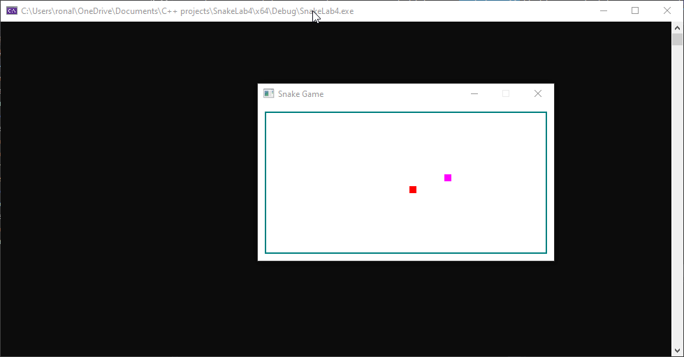

# SnakeGame
A snake game made in C++. This project was a in Lab project for my class of Programming Methodology (COP 2001) at Florida Gulf Coast University (FGCU). This was so much fun to actually make a game. Thanks to my professor Paul Allen for make it such a great experience.

## Demonstration

Here is an animated gif of the program running, show casing some of its main features.  
   

## Built With
* C++ project using Visual Studio.
* IDE: Microsoft Visual Studio Community 2019. 

## Contributing
Because of the timespan there were many things that I have to leave out. Thus, the program still has much room for improvement such as: there is a small issue withe the position of the border walls, where the game is actually over when the snake hit just a little bit further through the wall instead of finishing the game right when the contact is made between the snake and the wall. Also, especifically when the snake eats its second piece of food it does not appear to grow until it eats its next one where the size of snake is incremented twice. After that it appears to be normal  

## Author

* Ronald Quiroz.

## License

[License](LICENSE)  

## Acknowledgments

* My professor and the extra resources he gave us really helped me to learn what I was doing here.
* I appreciate the help of my professor Paul Allen for teaching me as best as he could whenever I got stuck.

## History

This is the final version of a program designed to be a in class lab project.

